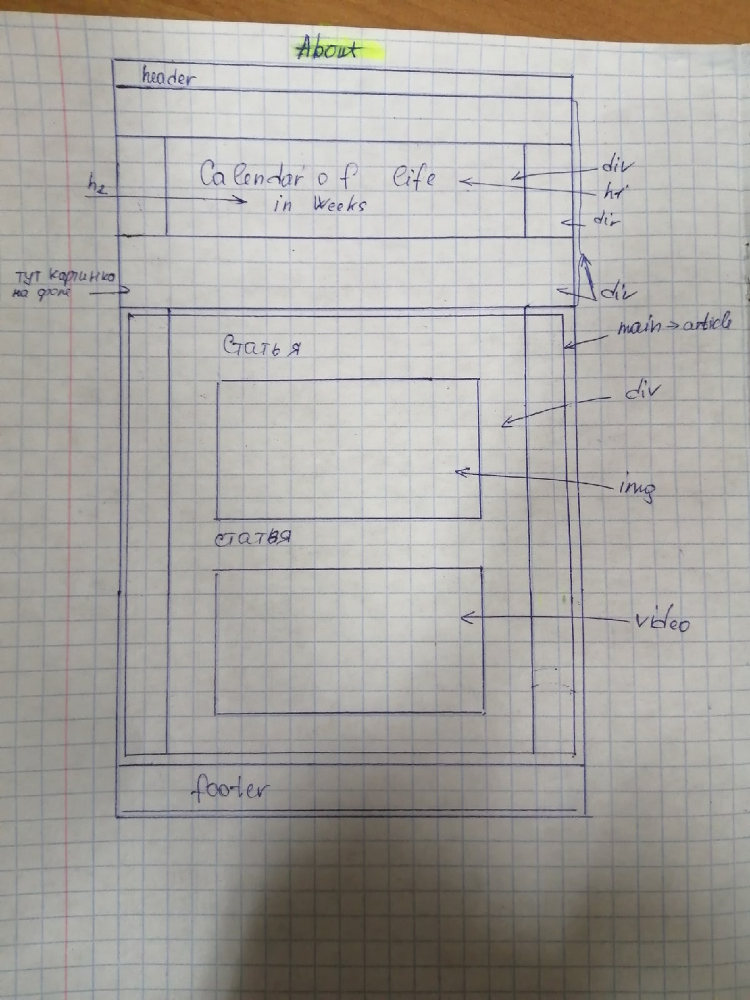
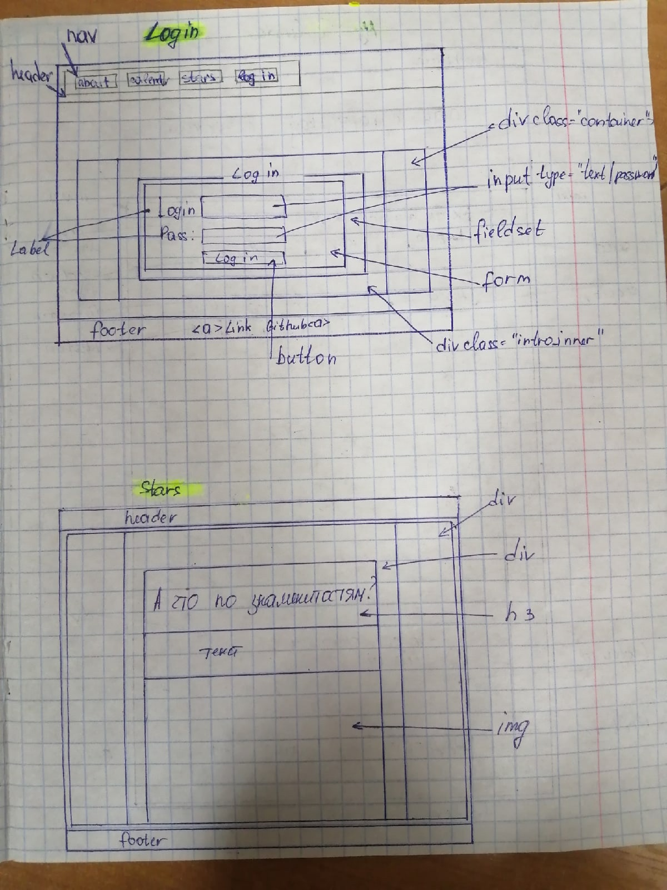
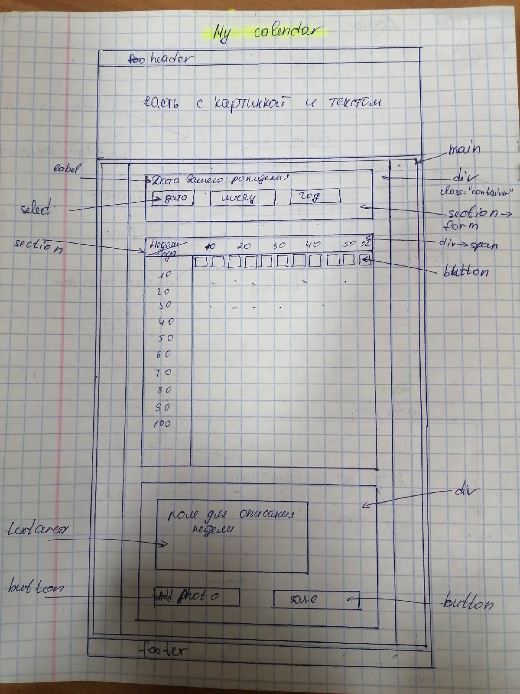

# Мазец Маргарита 953503

Календарь жизни в неделях

Цель данной лабораторной работы - разработать структуру проета. Сайт будет состоять из четырех страничек(about, my calendar, stars, log in).

Для того, чтобы познакомится, что представляет из себя такой кадендарь, рассмотрим страничку about.
 
Цель данной странички ознакомить пользователя с понятием "календарь жизни в неделях", поэтому она будет состоять из статьи, фотографий и видео. Часть, которая изначально попадает клиенту в глаза- название сайта на фоне(картинка), сверху - header, снизу - footer(более детальное их описание представлено на макете страницы [LogIn](https://github.com/rita-mazets/MyCalendarSite/blob/lab2/photo/LoginStars.jpg))

Перейдем к самой странице LogIn. Она предназначена для того. чтобы пользователь мог авторизироваться. Структуру можно увидеть на схеме:  Тут же можно рассмотреть, как устроены header и footer.А на следущем макете на том же фото представлена страница stars, которая является примером того, в какое время жизни некоторые известные люди достигли успехов.

И заключительная часть, сам календарь
Здесь можно ввести дату своего рождения и затем таблица(она представлена кнопками) разделится на две части: до текущего момента и после. При нажатии на любую неделю года
мы перейдем ниже и увидим поля, где можно ввести информацию о прожитой неделе, а также добавить фото.

Макет мобильной версии такой же как и пк.

На этом все!)
